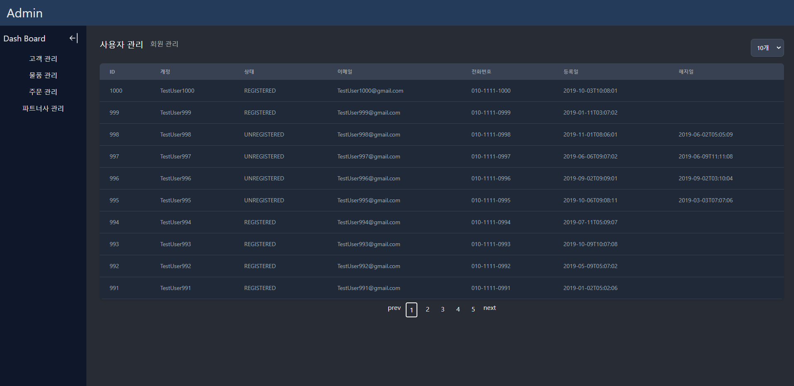

# 스프링 부트 연습하기 with fastcampus

## Admin Page 만들기

### 배운점

- HTTP Method
- Spring을 이용한 Rest Api 만드는 방법
- @EnableJpaAuditing를 이용한 Jpa Auditing (감시) 기능
- 추상화를 통한 기본적인 crud 자동화 기법
- 제네릭 타입을 이용한 외부에서의 타입 지정하는 방법
- stream의 다양한 기능들과 연습
- Optional을 이용한 npe 방지
- Lombok 사용법
- Jpa 사용법
- mysql worch bench를 통한 table 작성법
- 기초적인 query 공부
- N + 1 문제  
  1개의 쿼리를 조회하는데 연관 관계가 설정된 다른 객체의 데이터를 N번 더 호출하게 되는 문제이다.  
  원인 : N + 1 문제란 JPA의 쿼리 기본 생성 때문에 발생 하는 문제이다.  
  Eager : findAll은 (select * from orderGroup) jpql로 날린후 eager 전략이므로 즉시 연관된 데이터를 전부 조회해서 N + 1  
  Lazy : findAll은 (select * from orderGroup) jpql로 날린후 lazy 전략이므로 우선은 N + 1이 발생 하지 않지만 추후에 연관된 데이터의 정보를 선언하게 되면 그제서야
  각각의 연관 데이터에 대해 쿼리를 날려 N + 1 문제가 발생  
  문제 이유 : 연관된 데이터의 수 많큼 쿼리를 계속 날리면 성능적인 문제가 생기거나 너무 많은 데이터를 불러와 OOM(Out of Memory)가 발생할 수 있다.  
  해결 방안: fetch join 이나 EntityGraph룰 이용하여 inner join 형식으로 쿼리를 쏴서  
  N + 1 문제를 해결할 수 있다.  
  (그러나 EntityGraph는 연관관계가 복잡해 질 경우 굉장히 난해하기 때문에 추천하진 않지만 fetch 전략을 설정할 수 있다고 알고 있다.)  
  그러나 이 경우 pagination 과 같은 기능을 함께 사용하지 못하게 된다.  
  그렇기 때문에 나같은 경우에 application.properties 에 default batch size를 1000으로 설정하여  
  쿼리에 where in 절이 생성되게 하여 해결하였다.  
  많은 검색을 해보고 N+1 문제에 대해 이해하려고 노력했다.  
  그러나 이것이 적절한지에 대한 확신이 들지는 않는 거 같다.  
  결론: 실무에서는 lazy 전략을 채택하고 Batch size를 설정해두고  
  pagination이 필요없고 성능향상이 필요한 부분에서 fetch join을 하는 것이 적절해 보인다.

- front end 를 react를 이용하여 만들어 보았다.

- useState를 통한 상태 관리
- useRef로 특정(id) Dom 선택
- useEffect를 이용한 마운트/언마운트/업데이트 설정
- useMemo를 이용한 값 재사용 (react-hook-form)과 함께
- route 관리

### 느끼점

강의를 들으면서 위에 나열한 기법들을 통해서 개발 생산성을 높일 수 있을거 같았다.
또한 많은 어려움에 봉착하였지만 포기하지않고 끈질기게 고민해보면서 구글링하면서  
문제를 해결하는 방법을 조금이나마 깨우친거 같았다.

또한 가장 중요한것은 앞으로도 더 멋진 프로젝트를 만들 수 있을 거같은 자신감이 생겼다.